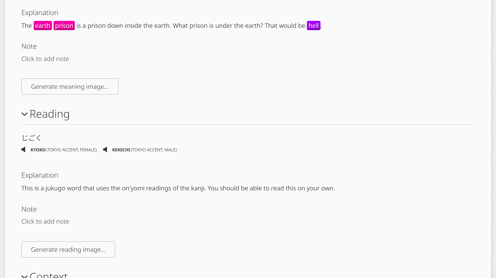
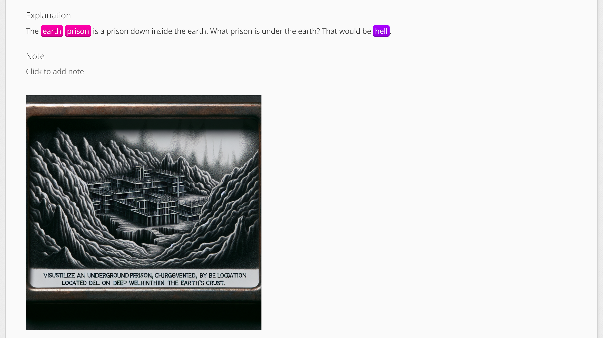

# WaniKani Mnemonic Images

Generate and display mnemonic images on WaniKani.

## Install

1. Install TamperMonkey

https://chromewebstore.google.com/detail/tampermonkey/dhdgffkkebhmkfjojejmpbldmpobfkfo

2. Install the Userscript

https://github.com/duffey/wanikani-mnemonic-images/raw/main/wanikani-mnemonic-images.user.js

## Usage

Any images previously generated by a user will be displayed on their respective subject pages and during reviews.

If an image has yet to be generated, a button will be shown allowing you to generate one. You will be prompted for an OpenAI API key. This is never saved on the server, but you will be asked if you would like to save it locally. Generating an image will incur charges to your account. At the time of this writing, an image costs $0.04.

https://openai.com/api/pricing/

## Copyright

I assume you maintain the copyright to the generated images, but generating an image will cause it to be hosted on wanikani-mnemonic-images.com and displayed to other users. If you wish for an image you generated to be removed, please let me know.

## Warranty

I am hosting the images at wanikani-mnemonic-images.com, and I reserve the right to stop hosting them at any time. If this happens, I will try to find someone else to maintain the project and give reasonable time for people to save the images.
