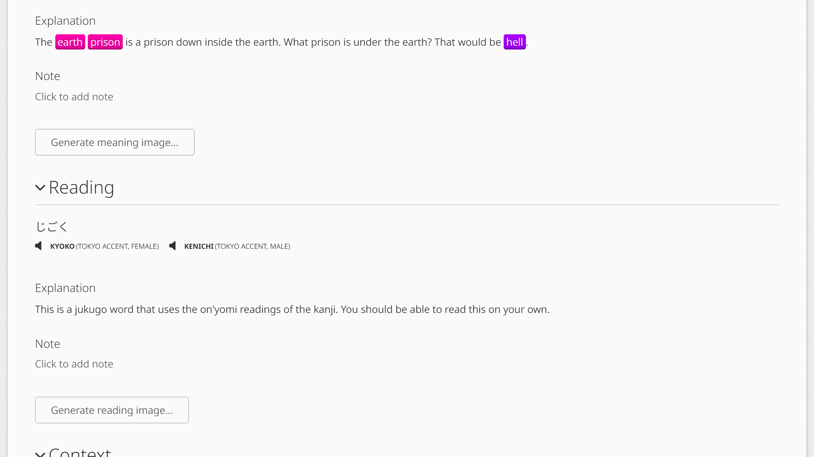

# WaniKani Mnemonic Images

Generate and display mnemonic images on WaniKani.

## Install

1. Install TamperMonkey:

   - [Chrome](https://chromewebstore.google.com/detail/tampermonkey/dhdgffkkebhmkfjojejmpbldmpobfkfo)
   - [Firefox](https://addons.mozilla.org/en-US/firefox/addon/tampermonkey/)
   - [Opera](https://addons.opera.com/en/extensions/details/tampermonkey-beta/)

2. Install the [Userscript](https://github.com/duffey/wanikani-mnemonic-images/raw/main/wanikani-mnemonic-images.user.js).

## Usage

Any images previously generated by a user will be displayed on their respective subject pages and during reviews.

If an image has yet to be generated, a button will be shown allowing you to generate one.
